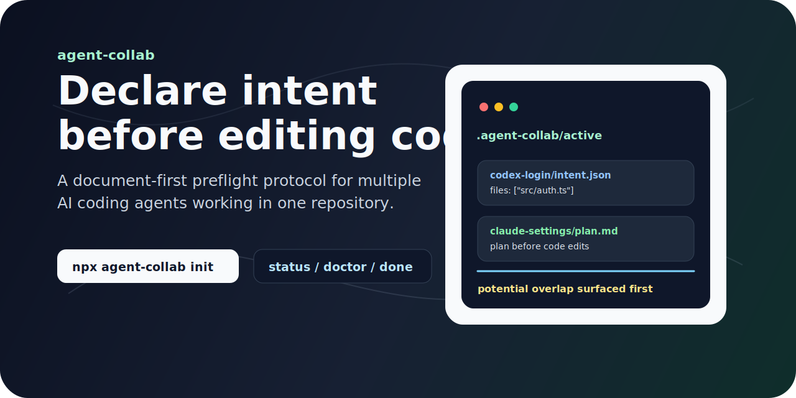

# agent-collab

[English](./README.md) · [繁體中文](./README.zh-TW.md)

[](./LICENSE)
[](https://github.com/Ruxiu0409/agent-collab/actions/workflows/ci.yml)
[](https://nodejs.org)
[](https://github.com/Ruxiu0409/agent-collab)

A tiny AGENTS.md companion that makes coding agents declare intent before editing shared code.

Stop Codex, Claude Code, Cursor, Gemini CLI, and other coding agents from silently working from stale context. `agent-collab` installs a document-first preflight protocol into your repository: every agent writes what it plans to touch before it edits code.

It does not replace Git, lock files, or fully prevent conflicts. It makes planned edits visible early so overlapping work can be surfaced before damage happens.

```bash
npx agent-collab init
```

## Why agent-collab

Multiple coding agents can be useful, until they start editing the same project from different memories of the codebase.

The classic failure:

1. Agent A reads `src/auth.ts`.
2. Agent B reads the same old version.
3. Agent A updates the file.
4. Agent B writes from stale context and accidentally undoes part of A's change.

Git shows the mess afterward. `agent-collab` adds a preflight step before code edits begin.

## Highlights

### Document-first preflight

Agents must read the protocol, inspect active work, check `git status --short`, re-read planned files, and create an intent before editing code.

### JSON metadata, Markdown plans

Every active intent is a small directory:

```txt
.agent-collab/active/<intent-id>/
  intent.json
  plan.md
```

`intent.json` is stable for the CLI. `plan.md` is where agents write the detailed plan, verification notes, and handoff context.

### Potential conflict detection

`agent-collab status` compares planned files and affected areas across active intents. When work overlaps, it reports a potential conflict and tells the agent to stop and ask the user before editing.

### Stale intent warnings

Each intent has `updated` and `expires` timestamps. `status` and `doctor` surface stale or expired work so old coordination files do not quietly become noise.

### AGENTS.md native

`agent-collab init` writes a managed section into `AGENTS.md`, the cross-tool instruction surface many coding agents already read.

## Get started

```bash
npx agent-collab init
```

Create an intent before editing:

```bash
agent-collab start \
  --agent codex \
  --title "Login validation" \
  --files src/login.ts,test/login.test.ts \
  --areas auth,login
```

Check current work:

```bash
agent-collab status
agent-collab doctor
```

Optionally install a pre-commit hook:

```bash
agent-collab install-hooks
```

The hook runs `agent-collab check-staged` before each commit. It blocks the commit when staged files are not listed in any active intent, or when staged files are claimed by multiple active intents. Bypass with `git commit --no-verify` when the overlap is intentional.

Archive completed work:

```bash
agent-collab done .agent-collab/active/<intent-id>
```

## Workflow

```txt
agent-collab init
        |
        v
Agent reads AGENTS.md + .agent-collab/protocol.md
        |
        v
Agent checks active intents + git status
        |
        v
agent-collab start --files ... --areas ...
        |
        v
Edit code, verify, update handoff notes
        |
        v
agent-collab done .agent-collab/active/<intent-id>
```

## Example intent

```json
{
  "schemaVersion": 1,
  "status": "active",
  "agent": "codex",
  "title": "Login validation",
  "started": "2026-05-26T06:30:00.000Z",
  "updated": "2026-05-26T06:30:00.000Z",
  "expires": "2026-05-26T10:30:00.000Z",
  "filesPlanned": ["src/login.ts", "test/login.test.ts"],
  "areasAffected": ["auth", "login"],
  "conflictCheck": {
    "checkedAt": "2026-05-26T06:30:00.000Z",
    "result": "no-conflict",
    "notes": "No active work touches the same files or affected areas."
  },
  "completion": {
    "changedFiles": [],
    "verificationRun": [],
    "handoffNotes": ""
  }
}
```

## Commands

| Command | Purpose |
| --- | --- |
| `agent-collab init` | Install `AGENTS.md` guidance and `.agent-collab/` protocol files. |
| `agent-collab start` | Create an active intent directory with `intent.json` and `plan.md`. |
| `agent-collab status` | List active intents, stale work, and potential overlaps. |
| `agent-collab doctor` | Validate setup, JSON intent files, git state, and stale intents. |
| `agent-collab install-hooks` | Install an optional pre-commit hook for staged-file intent coverage checks. |
| `agent-collab check-staged` | Check staged files against active intents; used by the pre-commit hook. |
| `agent-collab done` | Move completed work from `active/` to `archive/`. |

## Repo layout

| Path | Description |
| --- | --- |
| `src/core.ts` | Core protocol logic for init, start, status, doctor, and done. |
| `src/cli.ts` | Zero-dependency Node CLI entrypoint. |
| `test/core.test.ts` | Node built-in test coverage for the MVP behavior. |

## Development

```bash
npm test
npm run check
node src/cli.ts --help
```

This project currently uses Node's built-in TypeScript type stripping and built-in test runner, so the MVP has no runtime dependencies.

## Positioning

`agent-collab` is not a task board, project manager, background daemon, or agent orchestration runtime.

It is a coding-agent preflight protocol: small enough to keep in Git, explicit enough for humans to review, and structured enough for a CLI to warn when agents are about to step on each other's work.

## License

MIT
